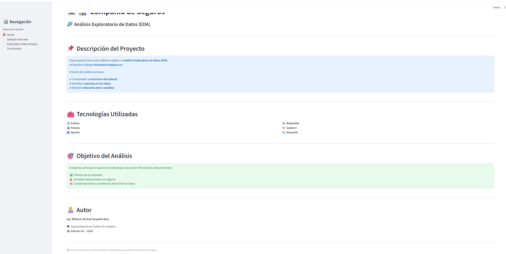
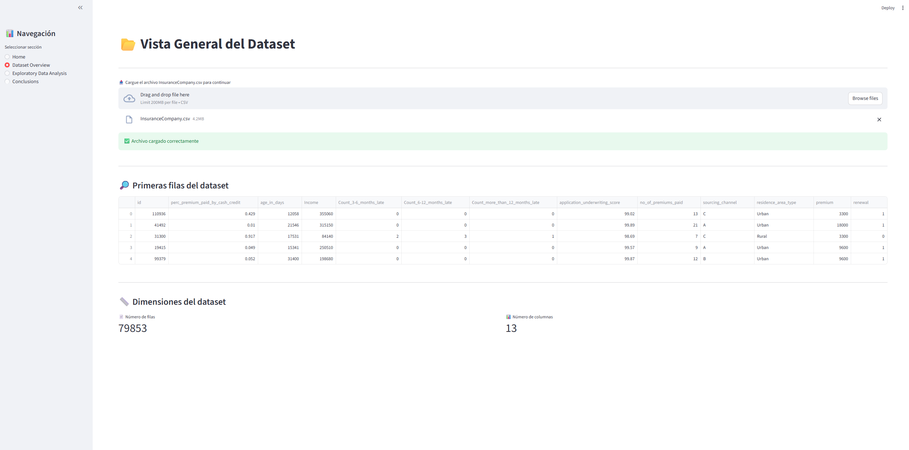
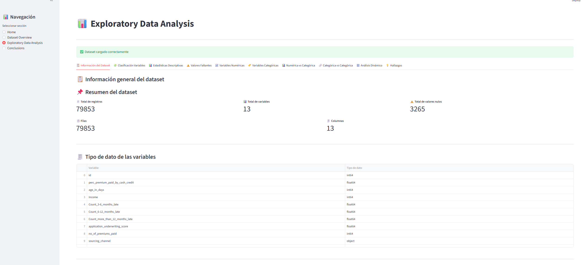
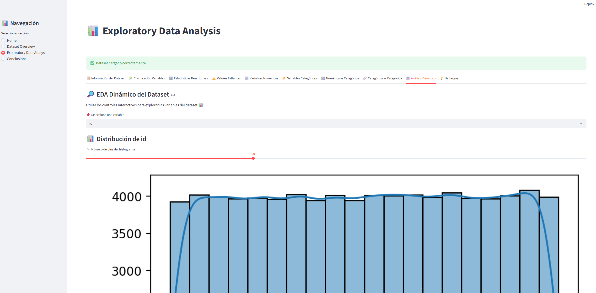
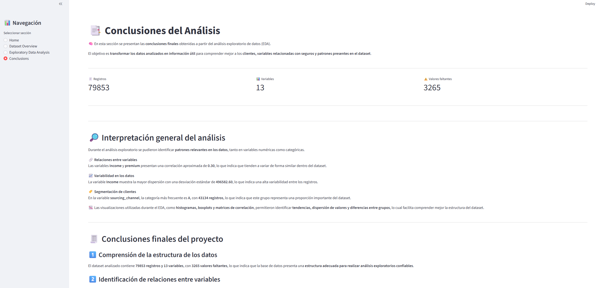

# 🏦 Insurance Company - Exploratory Data Analysis Dashboard
## 📊 Advanced Exploratory Data Analysis with Streamlit

---

## 📝 Descripción

Este proyecto consiste en el desarrollo de una **aplicación interactiva de análisis exploratorio de datos (EDA)** utilizando **Python y Streamlit** sobre el dataset **InsuranceCompany.csv**.

La aplicación permite **explorar, visualizar e interpretar datos relacionados con clientes y variables asociadas a seguros**, mediante un **dashboard analítico interactivo**.

El enfoque del proyecto es **analítico y exploratorio**, orientado a comprender los datos y descubrir patrones relevantes que puedan apoyar la **toma de decisiones basada en datos**.

El sistema integra:

- ✅ Python aplicado a Data Analytics  
- ✅ Análisis Exploratorio de Datos (EDA) estructurado  
- ✅ Visualización estadística con gráficos interactivos  
- ✅ Dashboard analítico en Streamlit  
- ✅ Exploración dinámica de variables  
- ✅ Identificación de patrones en datos de clientes y seguros  

---

# 🎯 Objetivo del Proyecto

El objetivo principal es **explorar el dataset InsuranceCompany.csv** para descubrir información relevante sobre:

- 👥 **Clientes de la compañía**
- 💰 **Variables relacionadas con seguros**
- 📊 **Comportamientos y tendencias en los datos**

El análisis permite:

- Comprender la estructura del dataset  
- Detectar patrones y relaciones entre variables  
- Analizar diferencias entre grupos de clientes  
- Identificar variables con mayor variabilidad  
- Explorar relaciones estadísticas entre variables  

El enfoque del proyecto es **analítico y exploratorio**, no predictivo.

---

# 🧱 Estructura del Proyecto
Insurance-EDA-Dashboard/
│
├── app.py
├── requirements.txt
├── README.md
└── InsuranceCompany.csv


---

# 📊 Funcionalidades del Dashboard

La aplicación está organizada mediante un **menú lateral de navegación** que permite acceder a diferentes módulos analíticos.

---

# 🏠 1. Home

- Presentación del proyecto  
- Descripción del objetivo del análisis  
- Tecnologías utilizadas  
- Información del autor  

---

# 📂 2. Dataset Overview

Permite cargar el dataset **InsuranceCompany.csv** de forma dinámica.

Incluye:

- Carga de archivo CSV
- Vista previa del dataset
- Métricas del dataset:
  - Número de registros
  - Número de variables
- Almacenamiento del dataset en `st.session_state`

Esto permite que los datos puedan ser utilizados en todas las secciones del análisis.

---

# 📊 3. Exploratory Data Analysis (EDA)

El análisis exploratorio está organizado en **10 módulos analíticos**.

---

## 1️⃣ Información del Dataset

- Métricas generales del dataset  
- Número de registros y variables  
- Conteo de valores nulos  
- Tipos de datos de cada variable  
- Vista estructurada del dataset  

---

## 2️⃣ Clasificación de Variables

Identificación automática de:

- Variables numéricas  
- Variables categóricas  

Incluye:

- Conteo de variables por tipo  
- Tabla con listado de variables  
- Gráfico de proporciones  

---

## 3️⃣ Estadísticas Descriptivas

Análisis estadístico de variables numéricas:

- `.describe()`  
- Media  
- Mediana  
- Mínimo  
- Máximo  
- Desviación estándar  

Incluye histogramas para visualizar la distribución.

---

## 4️⃣ Análisis de Valores Faltantes

Evaluación de calidad del dataset:

- Conteo de valores nulos por variable  
- Porcentaje de valores faltantes  
- Visualización mediante gráfico de barras  

---

## 5️⃣ Distribución de Variables Numéricas

Análisis visual de variables numéricas mediante:

- Histogramas con KDE  
- Métricas de tendencia central  
- Boxplots para detectar valores atípicos  

---

## 6️⃣ Análisis de Variables Categóricas

Exploración de variables categóricas mediante:

- Conteo de frecuencias  
- Tabla de proporciones  
- Gráficos de barras  
- Identificación de categorías dominantes  

---

## 7️⃣ Análisis Bivariado (Numérica vs Categórica)

Permite analizar cómo se comporta una variable numérica según categorías.

Incluye:

- Estadísticas por grupo  
- Boxplots comparativos  
- Tabla resumen de métricas  

---

## 8️⃣ Análisis Bivariado (Categórica vs Categórica)

Análisis de relación entre variables categóricas mediante:

- Tablas de contingencia  
- Mapas de calor (heatmap)  
- Tabla de porcentajes  

Esto permite detectar patrones entre categorías.

---

## 9️⃣ Análisis Dinámico

Módulo interactivo que permite explorar el dataset mediante widgets.

Incluye:

- `selectbox`
- `multiselect`
- `slider`
- `checkbox`

Permite:

- Visualizar distribuciones dinámicas
- Analizar correlaciones
- Explorar relaciones entre variables

---

## 🔟 Hallazgos Clave

Se presentan los principales insights derivados del análisis exploratorio:

- Correlaciones entre variables  
- Variables con mayor variabilidad  
- Categorías predominantes  
- Métricas generales del dataset  

---

# 📊 Conceptos Estadísticos Aplicados

Durante el análisis exploratorio se aplicaron diversos conceptos estadísticos:

- Media  
- Mediana  
- Desviación estándar  
- Distribución de variables  
- Comparación entre grupos  
- Correlación  
- Análisis bivariado  
- Proporciones  
- Segmentación de datos  

---

# 🖥️ Capturas de la Aplicación

## 🏠 Home



---

## 📂 Dataset Overview



---

## 📊 Exploratory Data Analysis



---

## 🔎 Análisis dinámico



---

## 📑 Conclusiones



---

# 🛠️ Tecnologías Utilizadas

El proyecto fue desarrollado utilizando:

- Python  
- Streamlit  
- Pandas  
- NumPy  
- Matplotlib  
- Seaborn  

Estas herramientas permiten desarrollar **aplicaciones analíticas interactivas para análisis de datos**.

---

# ⚙️ Instalación

Clonar el repositorio:

```bash
git clone https://github.com/williamsrupailla-dot/insurance-company-eda-dashboard.git

cd insurance-company-eda-dashboard

Instalar dependencias:

pip install -r requirements.txt

▶️ Ejecución

Ejecutar la aplicación:

streamlit run app.py

🔗 Enlaces del Proyecto
📁 Repositorio en GitHub

Código fuente del proyecto:

https://github.com/williamsrupailla-dot/insurance-company-eda-dashboard


🌐 Aplicación desplegada en Streamlit

Aplicación interactiva:

https://insurance-company-eda-dashboard-iy8pop2e9g5nvpskbremmx.streamlit.app/

✍️ Autor

Ing. Williams Michael Rupailla Ruiz

🎓 Especialización en Python for Analytics

📚 Edición 55 — 2026
